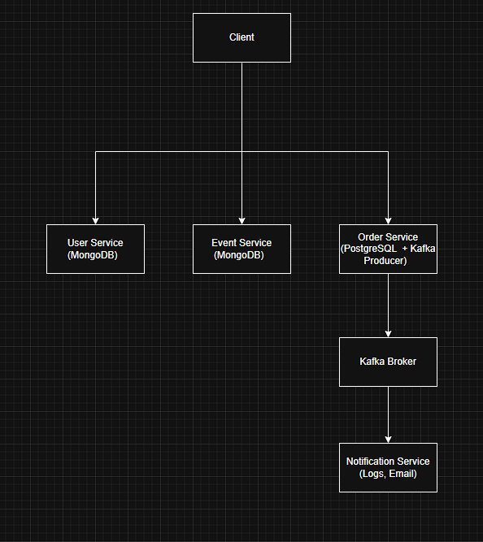

# 🎟️ Distributed Event Ticketing System

A scalable and distributed system for managing online event ticket sales, built with microservices architecture, Kafka for asynchronous communication, and MongoDB/PostgreSQL as databases.

---

## 📌 Tech Stack

- **Backend Framework:** Java + Spring Boot
- **Databases:**
  - MongoDB (User, Event services)
  - PostgreSQL (Order service)
- **Message Broker:** Apache Kafka
- **Architecture:** Microservices
- **Notification:** Log and email via Kafka consumer
- **Containerization:** Docker, Docker Compose (optional)
- **Deployment:** (coming soon - AWS / VPS setup)

## 🏗️ System Architecture

### 🔧 Key Components

| Service            | Tech Stack            | Description                                              |
|--------------------|------------------------|----------------------------------------------------------|
| **User Service**   | MongoDB                | Handles user data (registration, login)                  |
| **Event Service**  | MongoDB                | Manages event creation and listing                       |
| **Order Service**  | PostgreSQL + Kafka     | Creates orders, sends events to Kafka                    |
| **Kafka Broker**   | Apache Kafka           | Event bus connecting producers and consumers             |
| **Notification**   | Kafka Consumer + Email | Consumes events, sends logs/emails upon order success    |

---

## 🔁 Event Flow Example

1. Client requests to place an order
2. `Order Service` creates an order in PostgreSQL
3. Order Service emits an event to `Kafka`
4. `Notification Service` consumes event, logs it and sends email

---